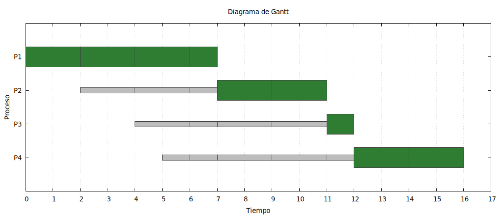
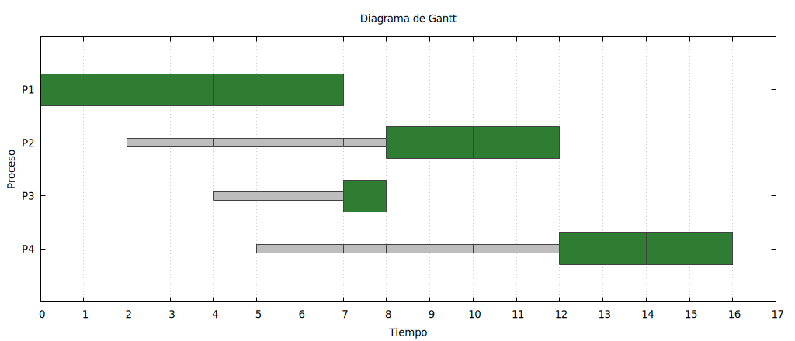
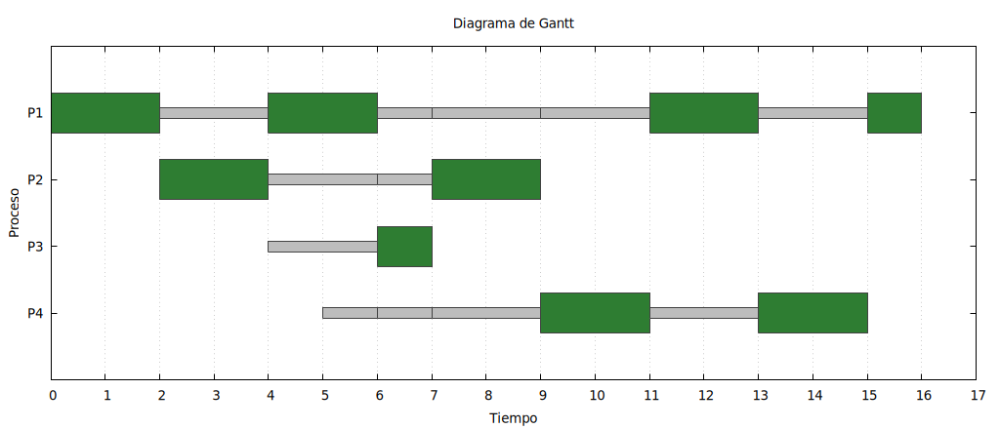
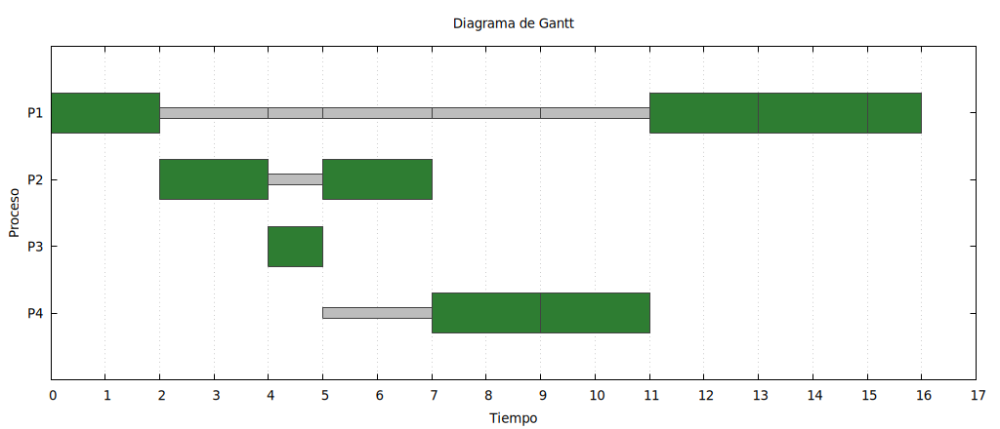
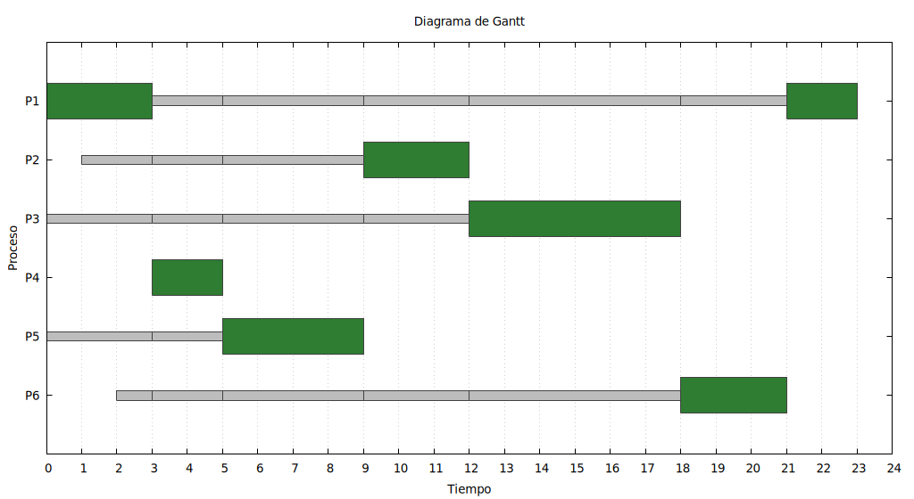
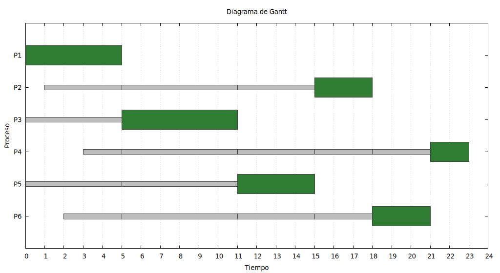

# Bitácora — Proyecto de planificación de procesos

**Laboratorio de Sistemas Operativos — Proyecto de primer corte**

## 1. Punto de partida

Descomprimimos el proyecto base, renombramos el directorio con nuestros logins
institucionales, compilamos con `make` y corrimos el caso de ejemplo
(`test/caso_1_fifo.txt`) para confirmar que el andamiaje ya funcionaba antes de
tocar nada. Efectivamente, con los cuatro `\todo` sin resolver, los cuatro
algoritmos daban el mismo resultado que FIFO — que es justo la señal que
menciona el enunciado para saber que falta trabajo.

Instalamos `gnuplot` (`sudo apt install build-essential gnuplot`) para que el
simulador generara también la imagen del diagrama y no solo los números.

## 2. Qué resolvimos y por qué

Los cuatro puntos están en `src/planificador.cpp`. Los explicamos uno por uno,
con la línea concreta que distingue a cada algoritmo, como pide la rúbrica.

### Punto 1 — El proceso que llega a una cola (`procesar_llegadas`)

Antes, todo proceso que llegaba se metía al final de la cola de listos con
`c.listos.push_back(p)`, sin importar el algoritmo. Eso es correcto para FIFO
y para RR, porque en esos dos el orden de atención es el orden de llegada.
Pero en SJF y en SRT el orden lo decide la ráfaga, no la llegada, así que
agregamos:

```cpp
if (c.estrategia == Estrategia::SJF || c.estrategia == Estrategia::SRT) {
    insertar_por_restante(c.listos, p);
} else {
    c.listos.push_back(p);
}
```

Esta es la primera línea que realmente separa "por orden de llegada" de "por
duración", que es la diferencia conceptual entre FIFO/RR y SJF/SRT.

### Punto 2 — La inserción ordenada (`insertar_por_restante`)

Esta función estaba vacía (solo hacía `push_back`). La reescribimos para que
busque la primera posición cuyo proceso tenga un restante **mayor**, y ahí
inserte:

```cpp
auto it = std::find_if(cola.begin(), cola.end(), [p](const Proceso *q) {
    return q->restante > p->restante;
});
cola.insert(it, p);
```

El detalle que casi se nos pasa, y que está explícito en los "errores
frecuentes" del enunciado, es el desempate: como `find_if` busca el primer
elemento *estrictamente mayor*, un proceso que llega con el mismo restante que
uno que ya estaba en la cola **no** lo adelanta — queda detrás. Así el
desempate lo sigue decidiendo el orden de llegada, que es el orden en que ya
estaban acomodados. Si hubiéramos buscado "mayor o igual" el proceso nuevo se
habría colado delante del que ya esperaba, y eso rompe el criterio de
desempate que pide la rúbrica.

### Punto 3 — El proceso que no termina su turno (switch dentro de `planificar`)

Aquí está, línea por línea, lo que distingue a cada algoritmo entre sí una vez
que ya sabemos ordenar:

- **FIFO** ya venía resuelto como ejemplo: `cola.listos.push_front(actual)`.
  Como no expropia, el proceso que tenía la CPU vuelve al frente de su cola,
  no al final, y nadie se le adelanta.
- **RR**: cambiamos el `push_front` que estaba de relleno por
  `cola.listos.push_back(actual)`. Es la única línea que distingue a RR de
  FIFO: en RR el proceso que agota su quantum sí pierde su lugar y se va al
  final, detrás de los que ya estaban esperando. Si esta línea queda como
  `push_front`, RR se comporta exactamente igual que FIFO, que es el error que
  más nos costó detectar al principio porque el promedio a veces igual "se
  parecía".
- **SJF**: dejamos `push_front`. La justificación es que SJF tampoco expropia
  (igual que FIFO), así que si un proceso no termina en su turno —solo puede
  pasar si el quantum de esa cola es menor que la ráfaga— conserva la CPU y
  vuelve al frente para que se la den de inmediato en el siguiente turno.
- **SRT**: usamos `insertar_por_restante(cola.listos, actual)`. Es la misma
  función del punto 2, porque en SRT el orden de la cola siempre es por
  tiempo restante, tanto para un proceso que acaba de llegar como para uno
  que vuelve de ejecutar.

### Punto 4 — La expropiación de SRT

Es el punto más largo. La idea: mientras el proceso `actual` tiene la CPU,
recorremos las llegadas de **su misma cola** (`cola.llegada`, que ya está
ordenada por instante de llegada desde `preparar()`) dentro de la ventana de
tiempo que le íbamos a conceder. Para cada llegada calculamos cuánto le
quedaría a `actual` en ese instante (su restante de ahora, menos lo que ya
habría ejecutado hasta esa llegada) y lo comparamos con la ráfaga completa del
que llega:

```cpp
const int restante_al_llegar = actual->restante - (llega->llegada - ahora);
if (llega->ejecucion < restante_al_llegar) {
    quantum_asignado = llega->llegada - ahora;
    cambiar_de_cola = false;
    break;
}
```

Si la ráfaga del que llega es menor, cortamos `quantum_asignado` justo en ese
instante y marcamos `cambiar_de_cola = false` para que la simulación no le
ceda el turno a la siguiente cola de prioridad — porque lo que pasó no fue que
`actual` terminara ni que se le acabara el quantum, sino que lo expropiaron
dentro de su propia cola. El resto del mecanismo (registrar la CPU usada,
procesar la llegada, reencolar a `actual` con `insertar_por_restante` porque
seguimos en el punto 3 de SRT) ya estaba armado y encaja solo.

Nos equivocamos la primera vez comparando la ráfaga del que llega contra el
restante *actual* de `actual` (el de antes del turno) en vez del restante que
tendría *en el instante de la llegada*. Con procesos largos eso daba
expropiaciones en el momento equivocado y el promedio de SRT no cuadraba.

## 3. Comprobación de resultados

Corrimos los cuatro casos del taller (`test/taller_fifo.txt`,
`test/taller_sjf.txt`, `test/taller_rr.txt`, `test/taller_srt.txt`) — el
conjunto con P1 (ráfaga 7 desde 0), P2 (4 desde 2), P3 (1 desde 4) y P4 (4
desde 5) — y las cuatro cifras coinciden con la tabla del enunciado:

| Algoritmo | Espera promedio esperada | Obtenida |
| --- | --- | --- |
| FIFO | 4.750 | **4.750** |
| SJF | 4.000 | **4.000** |
| RR (quantum 2) | 5.000 | **5.000** |
| SRT (quantum 2) | 3.000 | **3.000** |

No nos quedamos solo con el promedio, porque el enunciado advierte que dos
planificaciones distintas pueden empatar en la cifra. Revisamos también la
secuencia de ejecución y el diagrama de Gantt de cada caso:

- **FIFO**: `P1(2) P1(2) P1(2) P1(1) P2(2) P2(2) P3(1) P4(2) P4(2)`. P1 se
  queda con la CPU sin soltarla hasta terminar, aunque lleguen P2, P3 y P4
  mientras tanto.
- **SJF**: `P1(2) P1(2) P1(2) P1(1) P3(1) P2(2) P2(2) P4(2) P4(2)`. En cuanto
  P1 libera la CPU, P3 (que ya llegó con ráfaga 1, la más corta disponible) se
  cuela antes que P2 aunque P2 llevaba más tiempo esperando.
- **RR**: `P1(2) P2(2) P1(2) P3(1) P2(2) P4(2) P1(2) P4(2) P1(1)`. Se nota la
  alternancia típica de Round Robin, con P1 repartido en varios tramos de 2.
- **SRT**: `P1(2) P2(2) P3(1) P2(2) P4(2) P4(2) P1(2) P1(2) P1(1)`. Aquí sí se
  ve la expropiación: P1 arranca, pero en cuanto llega P2 con una ráfaga menor
  que lo que le resta a P1, P1 suelta la CPU antes de agotar su quantum.

Los diagramas de Gantt de estos cuatro casos, y de los `caso_1_*` (el
conjunto más grande que usa las mismas cuatro estrategias), están en `test/`
como archivos `.png`, generados automáticamente por `generar_grafica()` — esa
parte del código no la tocamos, ya venía resuelta. En ningún diagrama se
superponen los bloques verdes de un mismo eje de tiempo, que es la
comprobación básica de que solo hay una CPU.

#### FIFO — espera promedio 4.750

`P1 (2) P1 (2) P1 (2) P1 (1) P2 (2) P2 (2) P3 (1) P4 (2) P4 (2)`



#### SJF — espera promedio 4.000

`P1 (2) P1 (2) P1 (2) P1 (1) P3 (1) P2 (2) P2 (2) P4 (2) P4 (2)`



#### RR (quantum 2) — espera promedio 5.000

`P1 (2) P2 (2) P1 (2) P3 (1) P2 (2) P4 (2) P1 (2) P4 (2) P1 (1)`



#### SRT (quantum 2) — espera promedio 3.000

`P1 (2) P2 (2) P3 (1) P2 (2) P4 (2) P4 (2) P1 (2) P1 (2) P1 (1)`



## 4. Caso propio — punto 5 (colas de prioridad)

Construimos `test/caso_propio_colas.txt` con tres colas:

- **Cola 1** (la más prioritaria): RR, quantum 3.
- **Cola 2**: SJF, quantum 10 (mayor que cualquier ráfaga, para que dentro de
  su propio turno el proceso corra sin que el quantum lo corte a la mitad,
  que es lo que corresponde a un algoritmo sin expropiación).
- **Cola 3** (la menos prioritaria): FIFO, quantum 10 por la misma razón.

Con seis procesos (P1 y P2 en la cola 1, P3 y P4 en la cola 2, P5 y P6 en la
cola 3), el resultado da un promedio de espera de **9.833**.

Para comparar, armamos `test/caso_propio_una_cola.txt`: los mismos seis
procesos, con los mismos instantes de llegada y las mismas ráfagas, pero
todos en una sola cola FIFO. El promedio ahí sube a **10.667**.

La diferencia no es enorme, pero es consistente con lo que se espera: al
repartir los procesos en colas de prioridad, P1 y P2 (los de la cola más
alta) nunca tienen que esperar a que P3 o P5 —que llegaron al mismo tiempo,
pero en colas más bajas— usen la CPU primero. En una sola cola FIFO, en
cambio, todos compiten por el mismo turno según el orden de llegada, así que
un proceso de baja prioridad "de verdad" (como P3, con ráfaga 6) puede
retener la CPU y hacer esperar a procesos que en el esquema de colas habrían
pasado antes por estar en un nivel más alto. Eso es justo lo que pide explicar
el punto 5: el reparto entre colas cambia el resultado porque introduce una
prioridad entre procesos que, en una sola cola, no existe — ahí todos son
iguales y compiten solo por su instante de llegada.

**Con tres colas (espera promedio 9.833):**



**Los mismos procesos en una sola cola FIFO (espera promedio 10.667):**




## 5. Compilación

`make` compila sin advertencias con `-Wall -Wextra`:

```
$ make
g++ -std=c++17 -Wall -Wextra -O2 -Isrc -c -o obj/Linux/main.o src/main.cpp
g++ -std=c++17 -Wall -Wextra -O2 -Isrc -c -o obj/Linux/planificador.o src/planificador.cpp
g++ -std=c++17 -Wall -Wextra -O2 -Isrc -c -o obj/Linux/grafica.o src/grafica.cpp
g++ -std=c++17 -Wall -Wextra -O2 -Isrc -o planificador obj/Linux/main.o obj/Linux/planificador.o obj/Linux/grafica.o
```
